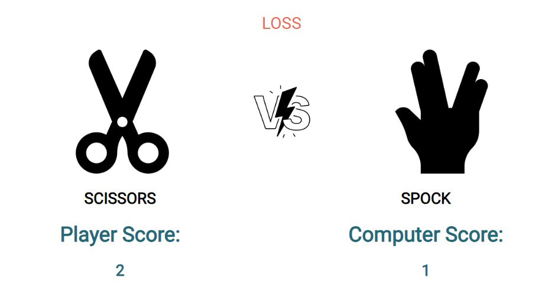
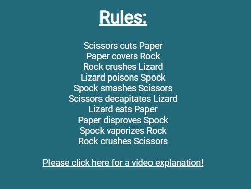
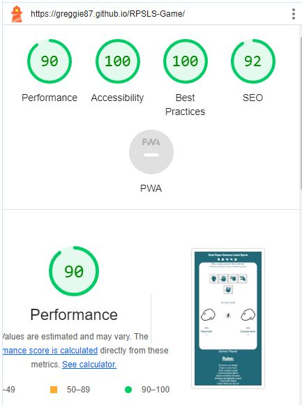
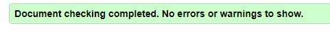
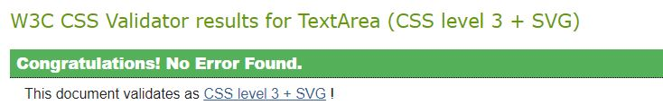
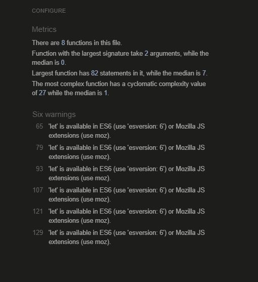

# Rock Paper Scissors Lizard Spock Web Game

[-> Link to live site here <-](https://greggie87.github.io/RPSLS-Game/)

Rock Paper Scissors Lizard Spock is a great adaptation of the classic game 'Rock Paper Scissors'. The game helps people to make descisions but with extra variables, giving a much more random result. People who are friendly with each other are likely to draw when playing rock paper scissors. This version of the game is played against the computer. The computer always picks at random so the results are almost infinitely variable.

The site is targeted at people of all ages and will help the user to understand the rules of the game as well as helping with potentially important descision making.

The game takes advantage of javascript event listeners with dynamic writing to elements in the DOM.

[-> Link to live site here <-](https://greggie87.github.io/RPSLS-Game/)

## Features

### Existing Features

- __Header__

  - The header is large and at the top of the page. It shows the name of the game 'Rock Paper Scissors Lizard Spock'.
  - The font chosen for the title is 'Roboto' via Google Fonts. This was chosen as it is a little more informal, adding to the fun and playfulness of the game. This font is used throughout the page.
  - The header also includes icons of all the game options to act as a logo.
  - The header is fully responsive to all screen sizes so that it always stays on one line.
  

- __Game Options__

  - The game options are clearly indicated in order to start the game.
  - The five options are shown as icons within buttons representing rock, paper, scissors, lizard or spock. These are of good size in order to be pressed/clicked easily.
  - The buttons each have aria-label decriptions to help with accessibility.
  

- __Game Area and Results__

  - Once the user has clicked one of the game choice buttons, it is shown as an image on the left hand side of the game area. The choice is also written in text form below the image for accessability.
  - The same is mirrored on the right hand side, however this is to show the random selection of the computer.
  - There is a 'vs' image in the middle of these two elements to show that the user is playing against the computer. This is also for aesthetic reasons.
  - When the game is active, the "Try your luck!" message at the top of the game area changes to show the result of the game in the form of win, loss or tie. These are colored green, red and yellow respectively. These colors are more of a 'pastel' shade to make things feel aesthetically softer.
  - The game area also shows a total amount of games won by both the player and the computer.

  
- __Games Played__

  - The game tallies the number of games played below the game area. This may be of interest to the user.

- __Rules__

  - At the bottom of the page there are a list of all outcomes of the game in order to help the player understand the results.
  - As a bonus, the rules section has a link to a video from 'The Big Bang Theory' where the rules are explained. This opens youtube in a separate window.
  

### Features Left to Implement

- Add a button to reset the game rather than reloading the whole page would be beneficial.
- Add option to do best of 3, best of 5 etc. This feature would be handy to give a definitive end to the game, while adding more variables to final outcomes for the player.

## Testing

- Every outcome of the game has been tested as correct.

- The site has been tested on multiple browsers and devices. Tweaks had to be made to media queries, as well as an overhaul of the choice buttons for mobile sized screens but all reacts well now.

- Every element of the site has been tested for reactiveness to different screen sizes. There is no overlapping of objects and everything is functional at all levels.

- A Lighthouse test was made, mainly testing for accessability issues. The results meant that improvements had to be made in the form of adding aria-labels and making the background a darker shade. The results are now good.

### Validator Testing

- HTML
  - No errors were returned when passing through the official W3C validator
  

  
- CSS
  - No errors were found when passing through the official W3C CSS validator

- JavaScript
  - No errors were found in the script code when using the JSHint Validator. There were however some warnings.

### Unfixed Bugs

- There are no known bugs in the site or game currently.

## Deployment

- The site was deployed to GitHub pages once enough of the repository was built. Code was built using Codeanywhere IDE.

## Credits

- 'W3Schools' for basic code to help with javascript syntax.
- 'Stack Overflow' for help with understanding concepts in the css styling of this page.
- 'Slack' for help from fellow students regarding fixing bugs in the javascript code.

### Media

- The photos used in the game results area are from 'Flaticon'.
- The icons used for the logo and buttons are via 'Fontawesome'.
- The video link is credit of 'Youtube' and 'The Big Bang Theory'.

Thank you for reading!

[-> Link to live site here <-](https://greggie87.github.io/RPSLS-Game/)
