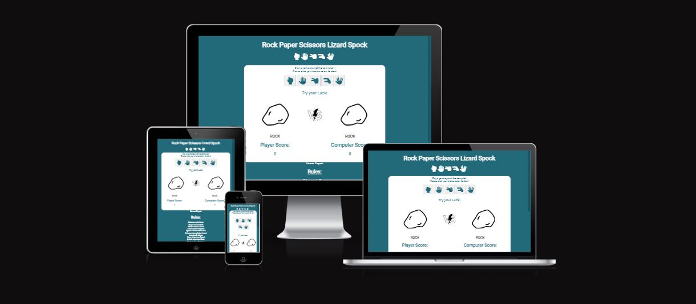
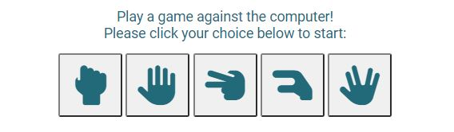

# Rock Paper Scissors Lizard Spock Web Game

[-> Link to live site here <-](https://greggie87.github.io/RPSLS-Game/)

Rock Paper Scissors Lizard Spock is a great adaptation of the classic game 'Rock Paper Scissors'. The game helps people to make descisions but with extra variables giving a much more random result. People who are friendly with each other are likely to draw when playing rock paper scissors. This version of the game is played against the computer. The computer always picks at random so the results are infinitely variable.

The site is targetted at people of all ages and will help the user to understand the rules of the game as well as helping with potentially important descision making.

[-> Link to live site here <-](https://greggie87.github.io/RPSLS-Game/)

## Features

### Existing Features

- __Header__

  - The header is large and at the top of the page. It shows the name of the game 'Rock Paper Scissors Spock'.
  - The font chosen for the title is 'Roboto' via Google Fonts. This was chosen as it is a little more informal, adding to the fun and playfulness of the game. This font is used throughout the page.
  - The header also includes icons of all the game options to act as a logo.
  - The header is fully responsive to all screen sizes so that it always stays on one line.
  

- __Game Options__

  - The game options are clearly indicated in order to start the game.
  - The five options are shown as icons within buttons representing rock, paper, scissors or spock. These are of good size in order to be pressed/clicked easily.
  - The buttons each have aria-label decriptions to help with accessibility.
  

